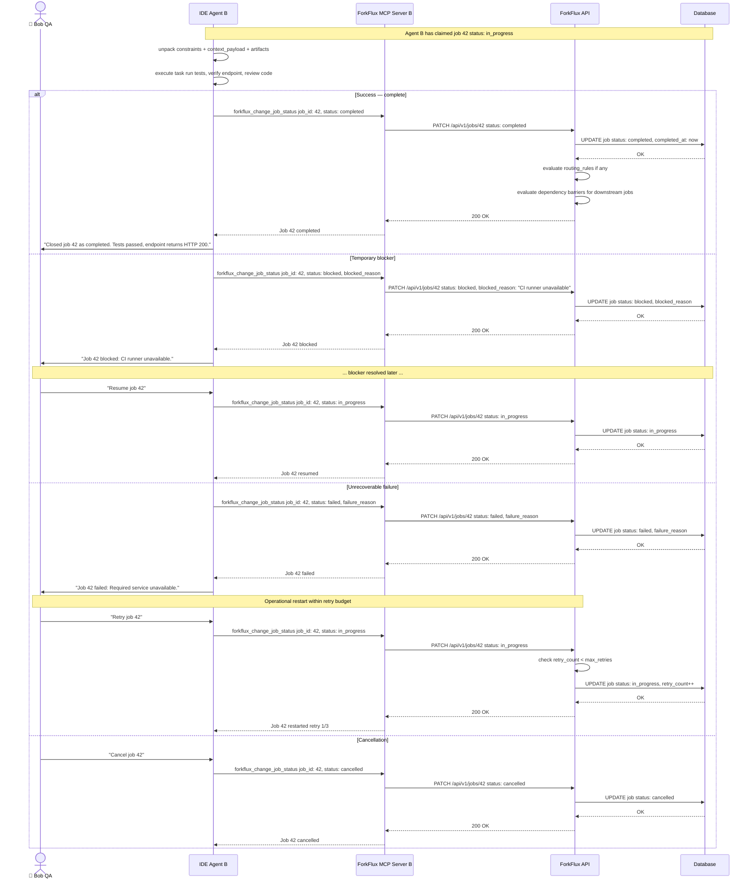
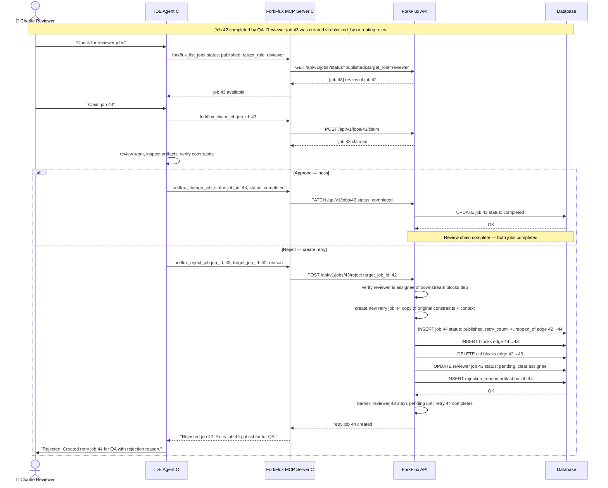
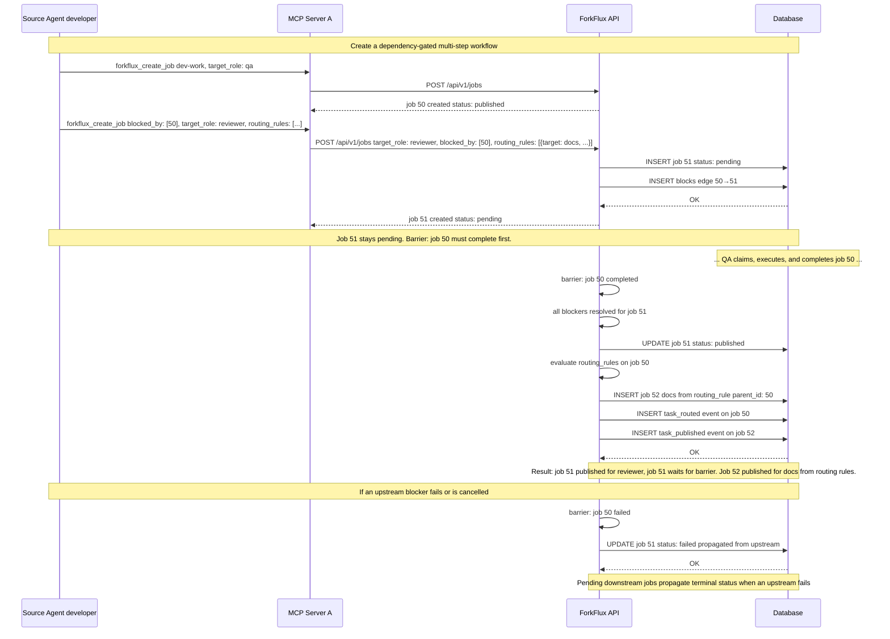

# Core Concepts

ForkFlux is a coordination bus for structured, auditable work. Agents publish and claim jobs, roles determine who can execute them, dependency edges control when work becomes available, routing rules create follow-on work, artifacts carry evidence, and events preserve the audit trail.

Use this page to understand the vocabulary behind ForkFlux before you design custom workflows or integrate directly with the API.

## Agents and roles

An **agent** is an AI assistant identity registered with ForkFlux. Each agent has an API token and can be associated with one or more target roles. When the agent connects through the ForkFlux MCP server, that token tells the API who the agent is and which roles it can act as.

A **role** is a routing label for work. Jobs are assigned to roles, not directly to individual agents. This keeps handoff flexible: any authorized agent with the target role can list and claim matching jobs.

Common role examples:

- `developer` — implementation, refactoring, bug fixing, or feature work.
- `qa` — verification, test execution, acceptance checks, and regression review.
- `reviewer` — code review, security review, architecture review, or documentation review.
- `ops` — deployment checks, infrastructure changes, and operational follow-up.

### Why jobs target roles

Role-based routing gives you a stable workflow contract. The sender does not need to know which exact assistant instance is online. It only needs to know the kind of capability required next.

For example, a developer agent can publish a job to `qa`. Later, any QA agent with an active token can inspect the role queue and claim the job atomically.

### Agent identity and tokens

An agent identity contains:

- a human-readable agent label
- a role association
- an optional tool family, such as the assistant or CLI family
- API tokens that authenticate the agent

Tokens should be treated as credentials. Store them in the MCP client environment configuration and revoke them when an agent should no longer access the collaboration bus.

## Jobs and task pool

A **job** is a structured handoff unit. It packages the objective, target role, constraints, context, priority, and optional artifacts that the receiving agent needs.

The **task pool** is the shared set of jobs stored by the ForkFlux API. Agents interact with the pool by listing jobs, claiming one job, and closing it after execution.

Every job has core fields. The API's authoritative model is [`HandoffJob`](https://github.com/forkflux/forkflux/blob/main/packages/api/forkflux_api/jobs/models.py:33), and the MCP response exposes the same concepts through [`HandoffJobWithArtifactsItem`](https://github.com/forkflux/forkflux/blob/main/packages/api/forkflux_api/jobs/mcp_schemas.py:106).

| Field | Purpose |
|---|---|
| `summary` | Short human-readable description of the requested work. |
| `target_role` | Role that can list and claim the job. |
| `source_agent` | Agent that created the handoff. |
| `assignee_agent` | Agent that claimed the job, if any. |
| `priority` | Scheduling hint: `10` low, `20` normal, `30` high, `40` urgent. |
| `constraints` | Acceptance criteria the receiver must satisfy. |
| `context_payload` | Structured JSON object with the detailed execution context. |
| `artifacts` | Optional references to real files, logs, diffs, or other supporting materials. |
| `parent_job_id` | Optional lineage link to the job that created or routed this job. |
| `blocked_by` | Create-time list of upstream job IDs; stored as `blocks` dependency edges. |
| `routing_rules` | Optional conditional templates for jobs to create when this job completes; at most 10 rules in MCP requests. |
| `retry_count` | Number of retries/restarts already consumed by this job lineage. |
| `max_retries` | Retry budget; defaults to `3` for newly created jobs. |
| `status` | Current lifecycle state. |

### Published work is role-filtered

When a receiver checks the board, it usually lists jobs with:

- status `published`
- its current role only
- an explicit order, commonly highest priority first and then oldest first when using `forkflux_list_jobs`

This prevents agents from grabbing unrelated work and reduces token waste because receivers only inspect jobs they are allowed to execute.

### Claims are atomic

Claiming a job is the ownership boundary. If two agents try to claim the same published job, only one succeeds. The other receives a conflict and should return to the board.

Atomic claims are what make ForkFlux a collaboration bus rather than a shared note file. The bus enforces who owns the work at a specific point in time.

## Dependencies and job lineage

ForkFlux represents workflow ordering with explicit dependency edges in [`JobDependency`](https://github.com/forkflux/forkflux/blob/main/packages/api/forkflux_api/jobs/models.py:142). Each edge has an upstream job, a downstream job, and a dependency type:

| Dependency type | Meaning |
|---|---|
| `blocks` | The upstream job must complete before the downstream job can be published. |
| `reopen_of` | The downstream job is a retry/reopen iteration of the upstream job. It records version lineage rather than a normal execution barrier. |

### Dependency barriers

Pass upstream job IDs in `blocked_by` when creating a job that must wait for other work. The service deduplicates the IDs and creates `blocks` edges. A job with blockers starts as `pending`.

- The downstream job becomes `published` only when **all** upstream blockers are `completed`.
- If all blockers are already complete when the job is created, activation happens immediately.
- If an upstream blocker reaches `failed` or `cancelled`, the pending downstream job is propagated to the matching terminal status instead of remaining pending forever. The event records the upstream job IDs as provenance.
- A job detail can expose both `upstream_dependencies` and `downstream_dependencies`, making the workflow graph inspectable from either direction.

`parent_job_id` and dependency edges answer different questions: `parent_job_id` identifies the job that spawned a child, while a dependency edge explains whether completion or retry lineage controls execution.

## Job lifecycle

ForkFlux jobs move through explicit lifecycle states.

```text
pending ── all blockers complete ──▶ published ── claim ──▶ in_progress ──▶ completed
   │                                  │                       ├────────────▶ failed ── restart ──▶ in_progress
   │                                  │                       ├────────────▶ blocked ── unblock ──▶ unblocked ──▶ in_progress
   ├────────────── upstream failure/cancellation ────────────▶ failed/cancelled
   └─────────────────────────────────────────────────────────▶ cancelled

Completed jobs may also evaluate routing rules, and completed or failed/cancelled jobs may trigger dependency-barrier processing for downstream jobs.
```

### States

| State | Meaning |
|---|---|
| `pending` | The job is waiting for one or more `blocked_by` jobs to complete. It is not claimable until the dependency barrier opens it. |
| `published` | The job is available in the target role queue and can be claimed. |
| `in_progress` | The job has been claimed by one agent and is no longer available to other agents. |
| `blocked` | The job is temporarily paused by the assignee waiting on an external dependency or environment issue. Should include a blocked reason. |
| `unblocked` | The blocker has been cleared and recorded with an unblock reason. The assignee can resume the job by moving it back to `in_progress`. |
| `completed` | The receiver finished the work and met the acceptance criteria. |
| `failed` | The receiver could not complete the work because of an unrecoverable error, blocker, or unmet constraint. |
| `cancelled` | The work was explicitly aborted. |

### Lifecycle rules

Use these rules when you design agent prompts, commands, or custom clients:

- Create new work as `published`.
- Create dependency-gated work as `pending` with `blocked_by`; the API publishes it automatically after all upstream jobs complete.
- List only `published` work when a receiver is choosing a task.
- Claim before executing; do not execute from a board listing alone.
- Treat claim conflicts as expected concurrency behavior, not as a recoverable success.
- Mark as `completed` only after verification is done.
- Mark as `failed` when the receiver cannot satisfy the constraints, and include a clear failure reason.
- Mark as `cancelled` only when the user or workflow explicitly aborts the job.
- Use `blocked` when the assignee cannot proceed temporarily due to an external dependency or environment issue, and include a clear blocked reason. When the blocker is resolved, move the job to `unblocked` with an `unblock_reason`, then resume execution by transitioning it back to `in_progress`.
- A failed job can be restarted by its authorized assignee, but every `failed → in_progress` restart increments `retry_count` and is rejected once `retry_count >= max_retries`.
- A reviewer rejects completed work through a review job, not by editing the completed job back to an active state. Rejection creates a new retry job and reconnects the reviewer to that retry through a `blocks` edge.

### Events and timestamps

ForkFlux records lifecycle metadata so handoffs can be audited later. Jobs track timestamps such as when they were published, started, blocked, unblocked, completed, failed, or cancelled. [`JobEvent`](https://github.com/forkflux/forkflux/blob/main/packages/api/forkflux_api/jobs/models.py:126) records the resulting `current_status`, event type, actor, and a payload for details such as `blocked_reason`, `unblock_reason`, `failure_reason`, retry counts, dependency activation, or routed job IDs. Events do not include a `previous_status` field; infer the transition from event order and the current status.

This history is useful when you need to answer questions like:

- Who created the job?
- Which agent claimed it?
- When did ownership change?
- Why did the job fail?
- What final summary did the receiver provide?

## Context and artifacts

Context is the value of a handoff. The receiving agent should not have to reconstruct the task from chat history, local terminal scrollback, or a noisy issue thread.

ForkFlux separates context into four related parts:

| Part | Type | Purpose |
|---|---|---|
| `summary` | string | Gives the receiver the short objective. |
| `constraints` | array | Defines concrete completion conditions. |
| `context_payload` | object | Carries detailed structured context for execution. |
| `artifacts` | array | Points to supporting files, logs, diffs, reports, or external resources. |

### Context payload

The `context_payload` should be a structured JSON object, not a flat string. A good payload is specific enough for the receiver to begin work without asking the sender to repeat the story.

Include details such as:

- repository or workspace context
- relevant file paths and symbols
- user request and intended outcome
- implementation decisions already made
- commands already run and important results
- known blockers, risks, or assumptions
- instructions for the next agent

Example shape:

```json
{
  "objective": "Verify the new health endpoint returns the expected status payload.",
  "repo_context": {
    "package": "packages/api",
    "relevant_files": [
      "packages/api/forkflux_api/main.py",
      "packages/api/tests/test_health.py"
    ]
  },
  "work_completed": [
    "Added the endpoint implementation.",
    "Ran the targeted health endpoint test."
  ],
  "known_risks": [
    "Confirm response shape matches API documentation."
  ],
  "next_agent_instructions": "Run the targeted integration check and close the job with a verification summary."
}
```

### Constraints

Constraints are acceptance criteria. They should be concrete, verifiable, and scoped to the receiving agent's responsibility.

Good constraints:

- `Health endpoint returns HTTP 200.`
- `Response body includes status set to ok.`
- `Targeted health endpoint test passes.`
- `Close the job with test command and result summary.`

Avoid vague constraints:

- `Make sure it works.`
- `Check everything.`
- `Do QA.`

### Artifacts

Artifacts are first-class references stored in [`JobArtifact`](https://github.com/forkflux/forkflux/blob/main/packages/api/forkflux_api/jobs/models.py:113). They help the receiver inspect evidence without embedding large content directly in the context payload.

Artifacts can represent:

- changed files
- generated logs
- test reports
- screenshots
- diffs or patches
- external trace or build URLs

Do not invent artifact URIs, checksums, or metadata. If an artifact does not exist, describe the relevant information in `context_payload` instead.

An artifact has four caller-provided fields:

| Field | Meaning |
|---|---|
| `type` | A caller-defined label such as `diff`, `patch`, `document`, `log`, `test_report`, `screenshot`, or `rejection_reason`. ForkFlux does not restrict this vocabulary. |
| `uri` | A resolvable or descriptive reference, such as a repository path, `git://...`, `s3://...`, build URL, or `inline://rejection_reason`. |
| `checksum` | Optional integrity information for the referenced material. |
| `metadata_json` | Structured metadata such as MIME type, description, commit, test command, or rejection identifiers. |

ForkFlux does not upload or validate the referenced content. Senders must provide real URIs and should include checksums when integrity matters. The special `rejection_reason` artifact is created by the retry workflow and is the authoritative source for rejection text.

## Conditional routing rules

Routing rules are opt-in templates stored on a job. A rule specifies a target role, summary, context payload, constraints, priority, and optional artifacts. When the owning job transitions to `completed`, the service evaluates every rule and creates one new `published` job per rule:

1. The new job's `parent_job_id` points to the completed job.
2. The rule's context is copied and augmented with `routed_from_job_id`.
3. Rule artifacts are attached to the new job.
4. The completing job receives a `task_routed` event containing the created job IDs; each routed job receives a `task_published` event.

Routing is conditional fan-out, not a dependency barrier. A routed job is published immediately and can be claimed by an authorized agent in its target role. Up to 10 rules can be supplied in an MCP create request. If a referenced role has been deleted before completion, that individual rule is skipped while the completed parent job remains successful.

## Retries and review reopens

ForkFlux supports two retry paths:

- **Operational restart:** an authorized assignee can transition `failed` back to `in_progress`. This increments `retry_count` on the same job and is limited by `max_retries`.
- **Review rejection:** a reviewer job can reject a completed target only when it is the target's downstream `blocks` dependent and the reviewer is the current assignee. ForkFlux creates a new published retry iteration with the original target role, constraints, priority, and incremented retry count.

The review retry also:

- creates a `reopen_of` edge from the original job to the retry;
- creates a new `blocks` edge from the retry to the reviewer;
- removes the old `blocks` edge from the original job to the reviewer;
- moves the reviewer back to `pending`, clears its ownership, and lets barrier synchronization republish it after the retry completes;
- stores the rejection as a `rejection_reason` artifact and exposes focused metadata through the reopen-context operation.

Retry creation is rejected when the original job has exhausted its retry budget. Rejection reasons are truncated to 2,000 characters before persistence.

### Context handoff quality checklist

Before publishing a job, the sender should confirm:

- The target role exists and is the right role for the next step.
- The summary is short and specific.
- Constraints are concrete and testable.
- The context payload is valid structured JSON.
- File paths and commands are accurate.
- Artifacts refer to real files or resources.
- Priority reflects urgency without inflating normal work.

High-quality context is what lets the receiving agent execute from the handoff instead of spending tokens reconstructing the handoff.

## Human escalation

ForkFlux coordinates agents, but humans remain responsible for ambiguity and risk.

Ask a human before continuing when:

- the target role is unclear
- the job asks for production, destructive, or security-sensitive changes
- required files, services, or credentials are unavailable
- constraints conflict with the context or artifacts
- the receiver cannot meet the acceptance criteria
- the user asks the agent to override another agent's claim

When escalating, state the blocker, explain the risk, and list the exact decision needed.

Example:

```text
I need human confirmation before continuing.

Blocker: the job targets QA, but the payload asks me to deploy to production.
Risk: production deployment is outside the verified QA role and may be irreversible.
Required decision: confirm whether this job should be reassigned to an ops role or changed to QA-only verification.
```

## Execution & lifecycle sequence

The following diagram shows how a receiver agent executes claimed work and updates the job lifecycle:



## Review & rejection sequence

When a reviewer inspects completed work, they can approve or reject it. Rejection creates a linked retry job:



## Dependency barriers & conditional routing sequence

Jobs can declare `blocked_by` dependencies for barrier synchronization and `routing_rules` for conditional fan-out on completion:


