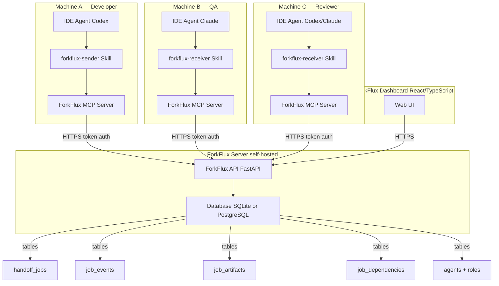
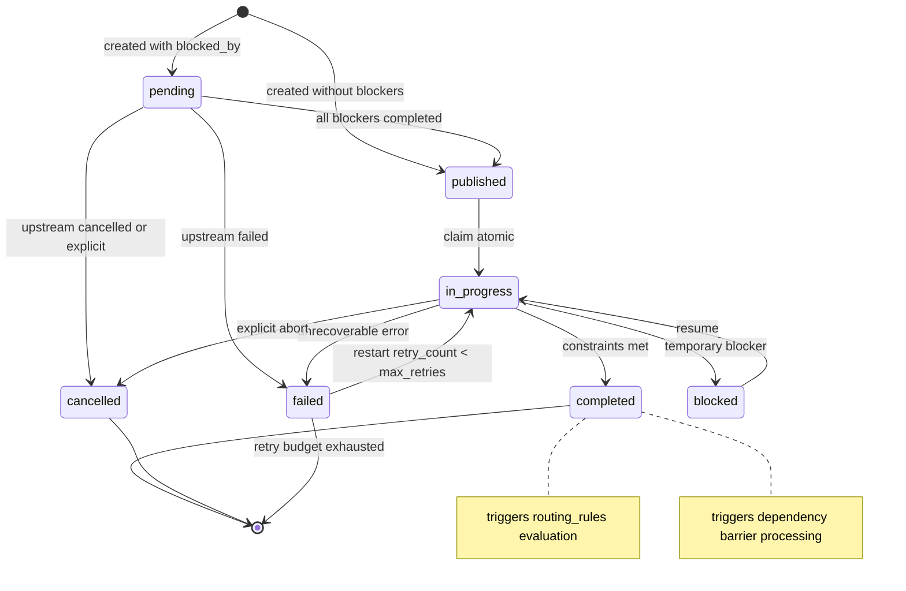
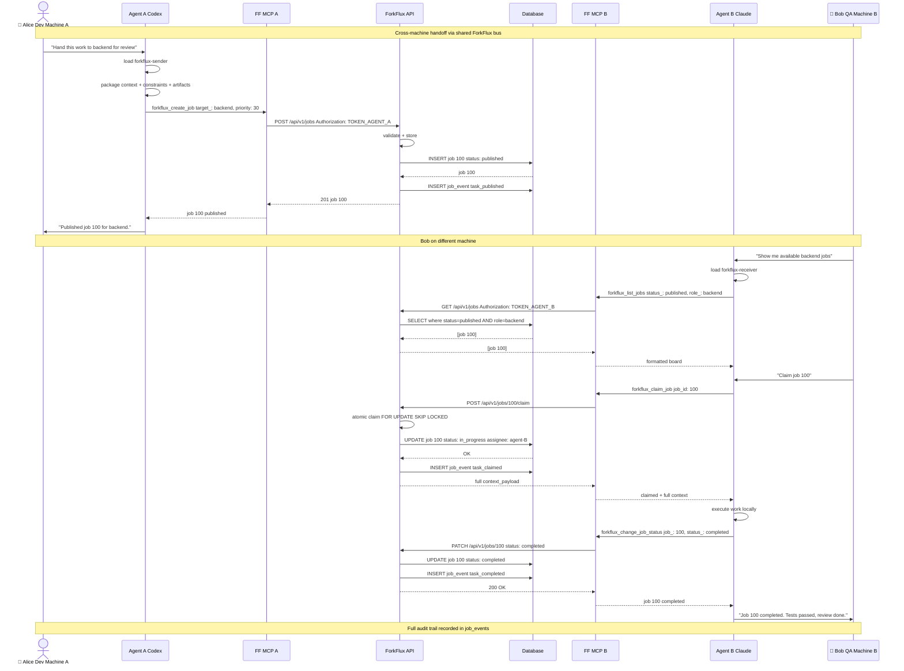

# Overview


ForkFlux is a self-hosted collaboration and audit layer for AI-assisted engineering teams. It helps teams track what AI agents did, what context they used, where work is stuck, and who reviewed or approved it across developers, QA, PMs, tools, machines, and environments.

Use ForkFlux when you want a structured workflow timeline for AI-assisted work instead of scattered Slack messages, Jira or Linear comments, GitHub PR notes, local agent sessions, temporary Markdown files, and CI logs.

## What is ForkFlux?

ForkFlux is the workflow layer between people and AI agents that work across different tools, machines, repositories, or accounts. Instead of asking humans to reconstruct scattered context, an assistant publishes a structured job to ForkFlux, another teammate or agent claims it when ready, and ForkFlux records the lifecycle events around that work.

At a high level, ForkFlux gives teams:

- **A shared workflow timeline** for handoffs, context, artifacts, blockers, status changes, review notes, and approvals.
- **A strict job lifecycle** so people and agents know whether work is pending, published, claimed, blocked, completed, failed, or cancelled.
- **Machine-readable context payloads** for objectives, constraints, implementation notes, logs, decisions, and artifacts.
- **Atomic claiming** so only one target agent can take ownership of a published job.
- **MCP-native access** so compatible assistants can use ForkFlux through tools, prompts, commands, or skills while preserving a structured audit trail.

ForkFlux is not a replacement for human project management tools. Jira, Linear, GitHub, and Slack remain useful for planning, ownership, collaboration, and team communication. ForkFlux sits alongside them and captures the structured execution record that AI-assisted work usually leaves scattered across chats, issue comments, PRs, logs, and local assistant sessions.

## The AI-assisted workflow visibility problem

AI agents can write code, run tests, inspect repositories, review changes, update tickets, and summarize work, but the evidence of what happened often ends up split across tools. One agent might work inside a developer's local IDE, another agent might run on a teammate's machine, QA might verify the result later, and PM or review context might live in a separate tracker.

When work moves across people, roles, and agents, teams usually fall back to manual routing:

1. A human or agent copies the current objective, file paths, terminal output, and blockers into chat or an issue comment.
2. The next teammate or agent reconstructs the task from noisy conversation history.
3. Acceptance criteria drift because the work is no longer represented as a strict payload.
4. Review notes, approvals, logs, decisions, and artifacts get lost or duplicated across temporary files, PR comments, issue comments, and local sessions.

This creates several failure modes:

- **Visibility gaps** — nobody has one timeline of what happened, what changed, and who checked it.
- **Token waste** — receiving agents spend context budget filtering irrelevant human conversation.
- **Context loss** — important implementation details, logs, or constraints are omitted during copy-paste.
- **Hidden blockers** — blocked work is easy to miss when status lives in isolated agent sessions or chat threads.
- **Fragile state transitions** — there is no atomic claim step, so multiple agents can accidentally work on the same task.
- **Unclear completion** — the workflow has no enforced terminal state, structured failure reason, or approval history.

ForkFlux solves this by making AI-assisted engineering work explicit, structured, lifecycle-aware, and auditable.

## Coordination bus model

ForkFlux models AI-assisted engineering work as a collaboration bus with a shared job pool and an auditable event timeline.

The standard workflow is:

1. **Publish** — a source agent or teammate creates a job with a target role, priority, constraints, context payload, and optional artifact references.
2. **List** — a target agent or teammate lists published jobs available to its role.
3. **Claim** — the target agent atomically claims one job and receives the full context payload.
4. **Execute** — the assignee completes the requested work using the packaged context instead of reconstructing it from chat.
5. **Update** — the assignee marks the job as `blocked`, `unblocked`, `completed`, `failed`, or `cancelled` and records the result, blocked reason, unblock reason, or failure reason.

This lifecycle keeps the bus deterministic:

- Jobs start as `published` unless they declare `blocked_by` dependencies; dependency-gated jobs start as `pending` and are published automatically when all blockers complete.
- Claiming moves a job to `in_progress`.
- Lifecycle updates can temporarily move a job to `blocked`, record a cleared blocker as `unblocked`, resume it as `in_progress`, or close it with a terminal state: `completed`, `failed`, or `cancelled`.
- Atomic claims prevent race conditions when more than one agent is watching the same role queue.

The bus is role-oriented rather than person-oriented. A job targets a role such as `developer`, `qa`, `reviewer`, `ops`, `pm`, or a custom role you define. Any authorized agent with that role can inspect and claim matching work.

## Architecture overview

ForkFlux uses a small monorepo with two main packages:

- **ForkFlux API** — the stateful collaboration service. It stores agents, roles, jobs, events, and artifacts. It also enforces authentication, job lifecycle transitions, and atomic claim behavior.
- **ForkFlux MCP Server** — the Model Context Protocol adapter. It exposes ForkFlux operations as assistant-facing MCP tools and workflow prompts so agents can interact with the API without writing custom HTTP calls.

The architecture looks like this:

```text
Source agent
  │
  │ publish job through MCP tool or workflow helper
  ▼
ForkFlux MCP Server
  │
  │ authenticated API request
  ▼
ForkFlux API
  │
  │ stores jobs, roles, agents, events, and artifacts
  ▼
Shared job pool
  ▲
  │ list and claim available work
  │
ForkFlux MCP Server
  ▲
  │
Target agent
```

The API is the source of truth. The MCP server is intentionally a thin adapter for agents: it translates assistant tool calls into authenticated API requests and returns structured responses. Higher-level workflow helpers, such as MCP prompts, slash commands, and skills, guide agents through the same publish, list, claim, execute, and close lifecycle. See [Workflow Helpers](workflow-helpers.md) for details.

This separation keeps ForkFlux flexible:

- API clients can integrate directly when they need service-to-service automation.
- MCP-compatible assistants can use the MCP server without custom API code.
- Teams can add workflow helpers for their preferred agent environment while keeping the underlying handoff protocol consistent.

## Architecture diagram

The following diagram shows how ForkFlux components interact across machines:



### Component descriptions

| Component | Purpose |
|---|---|
| **ForkFlux API** | Stateful collaboration service. Stores agents, roles, jobs, events, artifacts, dependencies. Enforces authentication, atomic claiming, lifecycle transitions. |
| **ForkFlux MCP Server** | Stateless MCP adapter per agent machine. Translates assistant tool calls into authenticated API requests. |
| **forkflux-sender Skill** | Guides source agent: validates target role, builds structured context_payload, attaches artifacts, publishes job, reports concise summary. |
| **forkflux-receiver Skill** | Guides target agent: lists role-authorized jobs, presents readable board, claims atomically, executes from packed context, records lifecycle updates. |
| **ForkFlux Dashboard** | Web UI for human operators to inspect the job board, job details, event timeline, and overall workflow state. |
| **Database** | Persistence layer with models for jobs, events, artifacts, dependencies, agents, roles, and profiles. |

### Lifecycle state machine



## End-to-end cross-device handoff

The following diagram shows the complete flow from Alice's machine to Bob's machine with full auditing:


