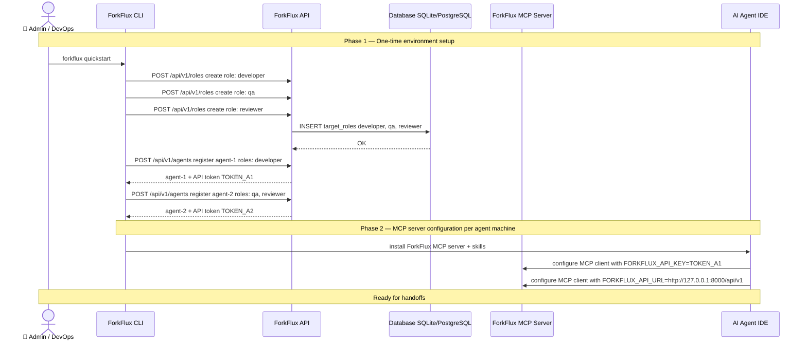

import Tabs from '@theme/Tabs';
import TabItem from '@theme/TabItem';

# Manual Setup

Manual setup gives you full control over the ForkFlux collaboration bus: database initialization, role names, agent identities, API tokens, MCP client configuration, and workflow helper installation.

Use this page when you want more control than the zero-config flow in [Quickstart](quickstart.md), when your assistant is not detected by `forkflux quickstart`, or when you are preparing a shared environment.

## Prerequisites

You need:

- The ForkFlux API CLI. Install `forkflux` with `pip` if you want to use the `forkflux` command directly, or use `uvx --from forkflux forkflux` when you want to run commands without installing the package.
- An MCP-compatible assistant or IDE.
- A Python runtime for `forkflux-mcp` when your MCP client starts it with `uvx`.
- Docker, only if you want to run the API and database through Docker Compose.

Install the CLI into your current Python environment:

```bash
pip install forkflux
```

Then run commands with `forkflux`:

```bash
forkflux init
```

Or run the CLI without installation by prefixing commands with `uvx --from forkflux`:

```bash
uvx --from forkflux forkflux init
```

## 1. Initialize the database

Initialize the ForkFlux database before you create roles, agents, or jobs:

<Tabs groupId="cli-command">
  <TabItem value="uvx" label="uvx">
    ```bash
    uvx --from forkflux forkflux init
    ```
  </TabItem>
  <TabItem value="installed" label="installed">
    ```bash
    forkflux init
    ```
  </TabItem>
</Tabs>

This applies the database migrations required by the API.

If you prefer a containerized setup, run the API and PostgreSQL through Docker Compose instead. The Compose path runs migrations in a dedicated service before starting the API. See [Self-Hosting](self-hosting.md) for the full Docker Compose example and production configuration notes.

## 2. Add workflow roles

Roles define which agents can receive which jobs. Add every role that exists in your handoff workflow, such as Developer, QA, Reviewer, Frontend, Backend, or DevOps.

Example:

<Tabs groupId="cli-command">
  <TabItem value="uvx" label="uvx">
    ```bash
    uvx --from forkflux forkflux agents-role add developer Developer
    uvx --from forkflux forkflux agents-role add qa "QA Engineer"
    ```
  </TabItem>
  <TabItem value="installed" label="installed">
    ```bash
    forkflux agents-role add developer Developer
    forkflux agents-role add qa "QA Engineer"
    ```
  </TabItem>
</Tabs>

Use stable role keys such as `developer` and `qa` in prompts and handoff jobs. Use display names such as `Developer` or `QA Engineer` for readability.

## 3. Register agents, assign roles, and save their API tokens

Register one ForkFlux agent for each assistant identity that will connect through MCP. Agent creation generates the API token; role assignment determines which role-targeted jobs the agent can list and claim.

Example sender agent:

<Tabs groupId="cli-command">
  <TabItem value="uvx" label="uvx">
    ```bash
    uvx --from forkflux forkflux agent add alice-codex
    ```
  </TabItem>
  <TabItem value="installed" label="installed">
    ```bash
    forkflux agent add alice-codex
    ```
  </TabItem>
</Tabs>

Example receiver agent:

<Tabs groupId="cli-command">
  <TabItem value="uvx" label="uvx">
    ```bash
    uvx --from forkflux forkflux agent add bob-claude
    ```
  </TabItem>
  <TabItem value="installed" label="installed">
    ```bash
    forkflux agent add bob-claude
    ```
  </TabItem>
</Tabs>

Each `forkflux agent add` command prints an API token. Save the token securely. You will use it as `FORKFLUX_API_KEY` in that assistant's MCP server configuration.

List the registered agents to find their numeric IDs:

<Tabs groupId="cli-command">
  <TabItem value="uvx" label="uvx">
    ```bash
    uvx --from forkflux forkflux agent list
    ```
  </TabItem>
  <TabItem value="installed" label="installed">
    ```bash
    forkflux agent list
    ```
  </TabItem>
</Tabs>

Assign the workflow roles to the matching agent IDs:

<Tabs groupId="cli-command">
  <TabItem value="uvx" label="uvx">
    ```bash
    uvx --from forkflux forkflux agent assign-role ALICE_AGENT_ID developer
    uvx --from forkflux forkflux agent assign-role BOB_AGENT_ID qa
    ```
  </TabItem>
  <TabItem value="installed" label="installed">
    ```bash
    forkflux agent assign-role ALICE_AGENT_ID developer
    forkflux agent assign-role BOB_AGENT_ID qa
    ```
  </TabItem>
</Tabs>

Replace `ALICE_AGENT_ID` and `BOB_AGENT_ID` with the numeric IDs shown by `forkflux agent list`.

:::tip

Use one token per assistant identity. Separate tokens keep role filtering, claims, job ownership, and audit history clear. If an assistant needs access to more than one queue, run `forkflux agent assign-role` once for each role.

:::

## 4. Run the collaboration bus server

Start the ForkFlux API server in a terminal you keep open:

<Tabs groupId="cli-command">
  <TabItem value="uvx" label="uvx">
    ```bash
    uvx --from forkflux forkflux serve
    ```
  </TabItem>
  <TabItem value="installed" label="installed">
    ```bash
    forkflux serve
    ```
  </TabItem>
</Tabs>

By default, the API runs on `http://127.0.0.1:8000`. MCP clients should use this API base URL:

```text
http://127.0.0.1:8000/api/v1
```

If you are using Docker Compose, start the stack instead of running `forkflux serve` directly. See [Self-Hosting](self-hosting.md) for the Compose command, service layout, environment variables, and health check.

## 5. Add the MCP server to your assistant

Configure each assistant to start the ForkFlux MCP server with that assistant's agent token. See [MCP Integration](mcp-integration.md) for client-specific configuration instructions for Claude Code, Cursor, VS Code, Cline, Codex, and other MCP-compatible clients.

Use the token printed when you registered the assistant's ForkFlux agent as `FORKFLUX_API_KEY`.

## Environment setup sequence

The following diagram shows the full environment setup and agent registration flow:



## 6. Add ForkFlux skills

Install the ForkFlux skill bundle so compatible assistants can run the sender and receiver workflows consistently:

```bash
npx skills add forkflux/forkflux
```

Reload or restart your assistant after installation so it can discover the skills.

For manual installation options and the difference between `forkflux-sender` and `forkflux-receiver`, see [Workflow Helpers](workflow-helpers.md#skills).

## 7. Run your first handoff

After the API is running, agents are registered, MCP is configured, and skills are installed, you can run your first handoff. See the [Workflow Helpers](workflow-helpers.md) page for guided sender and receiver workflows using skills, commands, or MCP prompts.

## Manual setup checklist

Before you start real handoffs, confirm that:

- the database is initialized or the Docker Compose stack is healthy
- all required workflow roles exist
- every assistant has its own ForkFlux agent and API token
- the collaboration bus server is running
- each MCP client has the correct `FORKFLUX_API_KEY` and `FORKFLUX_API_URL`
- ForkFlux skills are installed and visible to the assistant
- the sender and receiver can call ForkFlux MCP tools successfully
