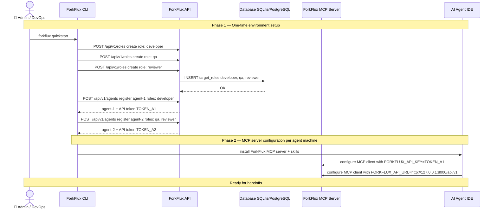
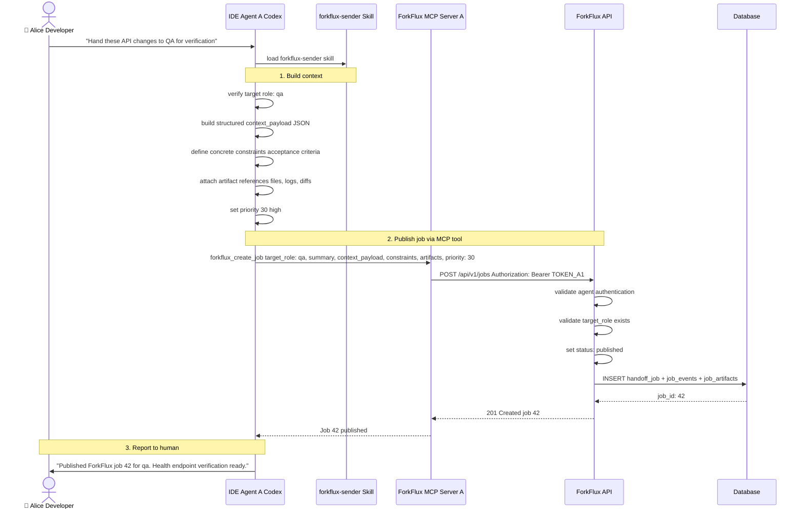
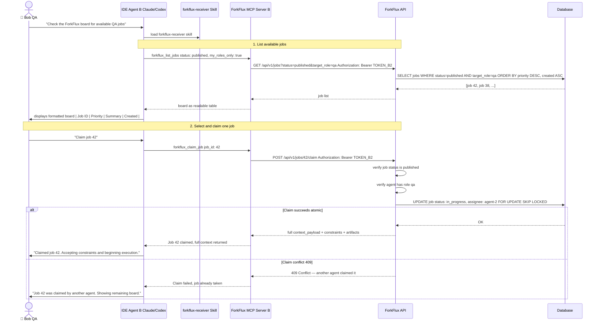
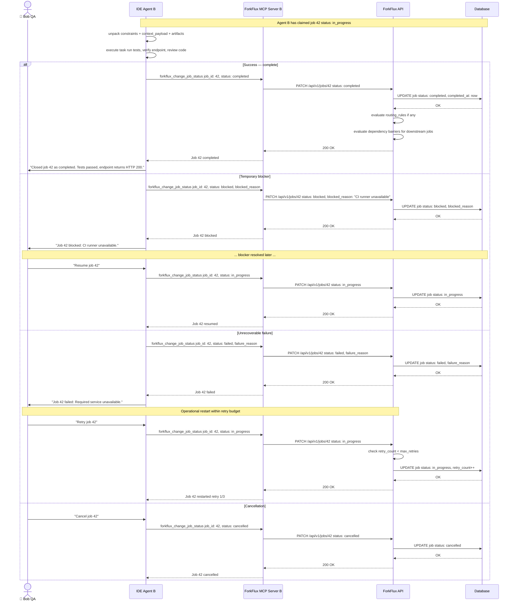
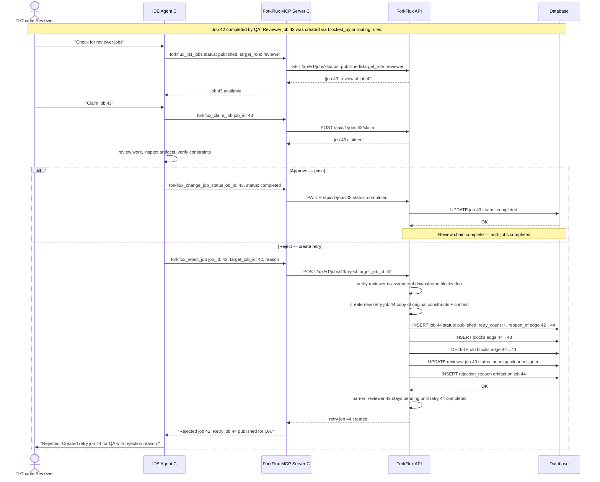
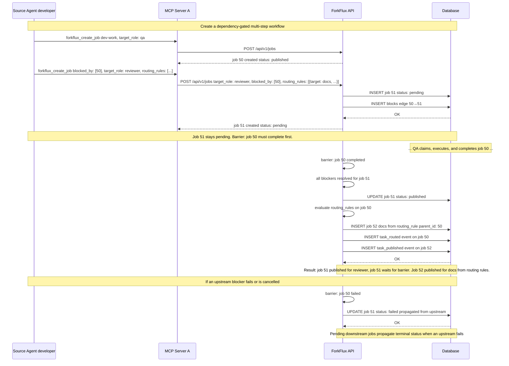
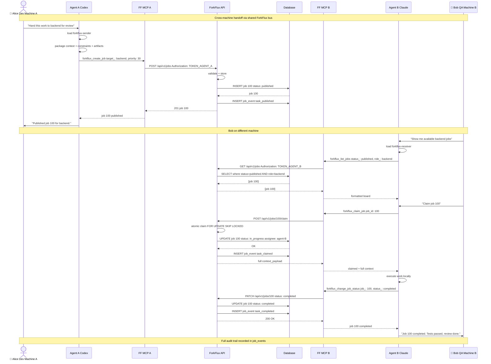
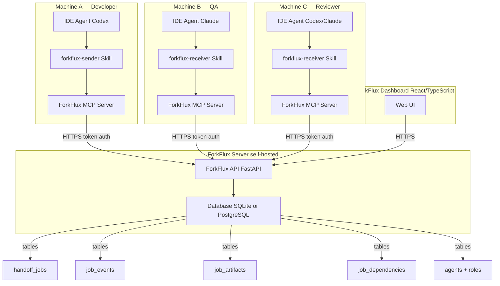
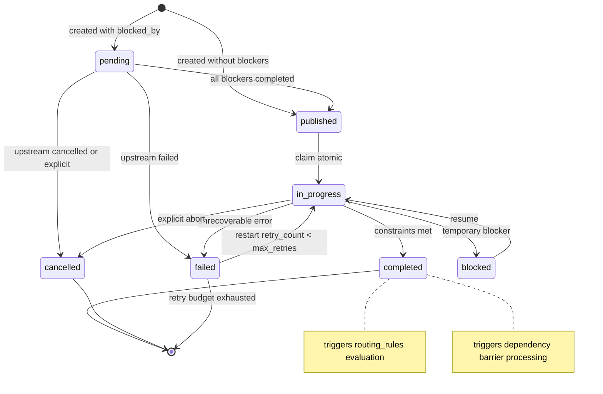

# AI Agent Integration Sequence Flow Diagrams

## Table of Contents

1. [Environment Setup & Agent Registration](#1-environment-setup--agent-registration)
2. [Job Publishing — Sender Workflow](#2-job-publishing--sender-workflow)
3. [Job Discovery & Claiming — Receiver Workflow](#3-job-discovery--claiming--receiver-workflow)
4. [Execution & Lifecycle Updates](#4-execution--lifecycle-updates)
5. [Review & Rejection Workflow](#5-review--rejection-workflow)
6. [Dependency Barriers & Conditional Routing](#6-dependency-barriers--conditional-routing)
7. [End-to-End Cross-Device Handoff](#7-end-to-end-cross-device-handoff)
8. [Architecture Overview](#8-architecture-overview)

---

## 1. Environment Setup & Agent Registration

Before any handoff can occur, the ForkFlux collaboration bus must be provisioned with roles, agents, and MCP server configurations.

---

## 2. Job Publishing — Sender Workflow

When a source agent finishes local work and hands it to another role (e.g., developer → QA), it uses the `forkflux-sender` skill.

---

## 3. Job Discovery & Claiming — Receiver Workflow

A target agent on another machine lists available work and atomically claims one job.

---

## 4. Execution & Lifecycle Updates

After claiming, the receiver executes the work and updates the job lifecycle — completing, failing, blocking, or restarting.

---

## 5. Review & Rejection Workflow

A reviewer claims a job that depends on completed work, inspects it, and can either approve or reject it. Rejection creates a linked retry job.

---

## 6. Dependency Barriers & Conditional Routing

Jobs can declare `blocked_by` dependencies (barrier synchronization) and `routing_rules` (conditional fan-out on completion).

---

## 7. End-to-End Cross-Device Handoff

The complete flow from Alice's machine to Bob's machine, with auditing.

---

## 8. Architecture Overview

### Component Descriptions

| Component | Purpose |
|---|---|
| **ForkFlux API** | Stateful collaboration service. Stores agents, roles, jobs, events, artifacts, dependencies. Enforces authentication, atomic claiming, lifecycle transitions. |
| **ForkFlux MCP Server** | Stateless MCP adapter per agent machine. Translates assistant tool calls into authenticated API requests. |
| **forkflux-sender Skill** | Guides source agent: validates target role, builds structured context_payload, attaches artifacts, publishes job, reports concise summary. |
| **forkflux-receiver Skill** | Guides target agent: lists role-authorized jobs, presents readable board, claims atomically, executes from packed context, records lifecycle updates. |
| **ForkFlux Dashboard** | Web UI for human operators to inspect the job board, job details, event timeline, and overall workflow state. |
| **Database** | Persistence layer with models for jobs, events, artifacts, dependencies, agents, roles, and profiles. |

### Lifecycle State Machine

---

## Summary

This sequence diagram set documents every integration path between AI agents and the ForkFlux collaboration bus:

1. **Setup**: Admin provisions roles, agents, tokens, and MCP server configurations.
2. **Publish**: Source agent uses `forkflux-sender` skill → `forkflux_create_job` MCP tool → API persists job as `published`.
3. **Discover**: Target agent uses `forkflux-receiver` skill → `forkflux_list_jobs` MCP tool → API returns role-filtered board.
4. **Claim**: Target agent calls `forkflux_claim_job` → API executes atomic `FOR UPDATE SKIP LOCKED` → job transitions to `in_progress`.
5. **Execute & Update**: Target agent does the work → calls `forkflux_change_job_status` → API records lifecycle event.
6. **Review**: Reviewer claims dependent job → inspects → either completes or calls `forkflux_reject_job` to create a retry.
7. **Dependencies & Routing**: `blocked_by` creates barrier-synchronized workflows; `routing_rules` creates conditional fan-out on completion.

