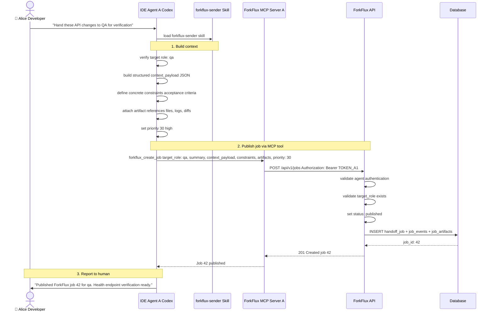
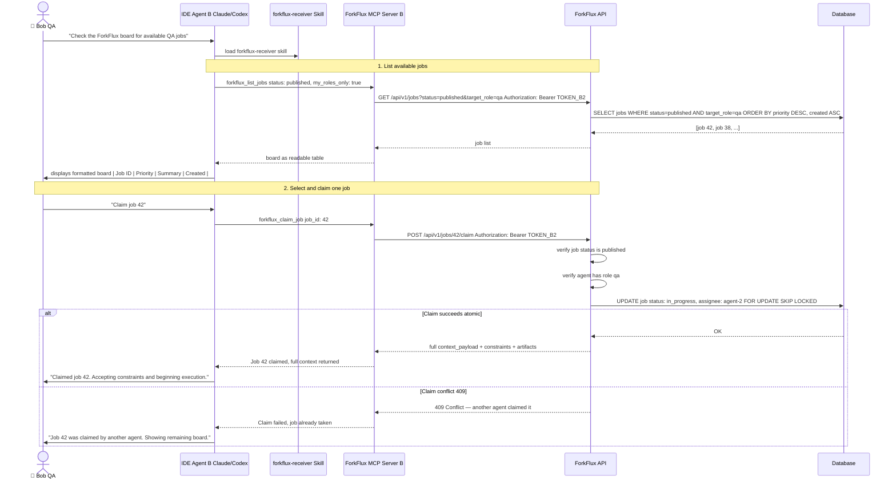

import Tabs from '@theme/Tabs';
import TabItem from '@theme/TabItem';

# Workflow Helpers

ForkFlux provides three layers of workflow helpers that guide assistants through the publish → list → claim → execute → close lifecycle. All helpers call ForkFlux MCP tools directly; they differ only in how they integrate with your assistant.

## Which helper should I use?

| Helper | Best when | Learn more |
|---|---|---|
| [Skills](#skills) | Your assistant supports reusable skills or playbooks, and you want versioned, team-shared workflow rules. | [Skills section](#skills) |
| [Commands](#commands) | Your assistant supports custom slash commands or command files but not reusable skills. | [Commands section](#commands) |
| [MCP Prompts](mcp-integration.md#mcp-prompts) | Your assistant exposes MCP prompt surfaces from the ForkFlux MCP server directly. | [MCP Integration](mcp-integration.md#mcp-prompts) |
| Direct MCP tools | Your assistant supports MCP tools but not prompts, skills, or commands. | [MCP Integration](mcp-integration.md#available-tools) |

## All helper operations

Every helper layer supports the same seven ForkFlux operations:

| Operation | Skill | Command | MCP Prompt | MCP Tool |
|---|---|---|---|---|
| Publish job | `forkflux-sender` | `/ff-push` | `push` | `forkflux_create_job` |
| List board | `forkflux-receiver` | `/ff-board` | `board` | `forkflux_list_jobs` |
| Claim job | `forkflux-receiver` | `/ff-claim` | `claim` | `forkflux_claim_job` |
| Close/update status | `forkflux-receiver` | `/ff-close` | `close` | `forkflux_change_job_status` |
| Update context | `forkflux-sender` | `/ff-update` | `update` | `forkflux_update_job` |
| Reject work | `forkflux-receiver` | `/ff-reject` | `reject` | `forkflux_reject_job` |
| Reopen context | `forkflux-receiver` | `/ff-reopen-context` | `reopen-context` | `forkflux_get_reopen_context` |

All helpers should call ForkFlux MCP tools directly. Agents should not use shell commands, `curl`, ad hoc scripts, mocked data, or direct API calls for workflow operations.

## Skills

ForkFlux skills are reusable assistant playbooks that make agent handoffs predictable. They encode the sender and receiver workflows so agents use ForkFlux MCP tools directly, validate inputs, avoid raw JSON dumps, and report concise lifecycle updates.

Use skills when your assistant supports reusable playbooks and you want behavior to remain consistent across sessions. Skills are especially useful for teams because the workflow rules live in versioned files instead of ad hoc prompts.

### Available skills

ForkFlux ships two workflow skills:

| Skill | Purpose | Best for | Primary MCP tools |
|---|---|---|---|
| `forkflux-sender` | Packages verified context, constraints, artifacts, dependencies, and optional follow-on routing into a new role-targeted job, and can correct mutable fields on a published handoff. | Source agents that need to publish work after local progress is ready for transfer. | `forkflux_create_job`, `forkflux_update_job`, optionally `forkflux_change_job_status` |
| `forkflux-receiver` | Lists role-authorized work, claims one job atomically, executes from its packed context, and records blocked, resumed, terminal, or review-retry outcomes. | Target agents that need to pull work from the shared task pool and report evidence. | `forkflux_list_jobs`, `forkflux_claim_job` or `forkflux_claim_next_job`, `forkflux_update_job`, `forkflux_reject_job`, `forkflux_get_reopen_context`, `forkflux_change_job_status` |

### `forkflux-sender`

Use `forkflux-sender` when an agent needs to publish completed or transferable work to another role.

The skill guides the source agent to:

1. Verify the exact target role key before creating a job.
2. Convert the requested outcome into concrete acceptance criteria.
3. Build a structured `context_payload` with relevant files, decisions, blockers, and next-agent instructions.
4. Attach only real artifacts such as files, logs, diffs, reports, screenshots, or URLs.
5. Create a ForkFlux job with a valid priority.
6. Optionally include dependency IDs (`blocked_by`) or conditional follow-on routing rules.
7. Return a concise summary with the job ID, target role, constraints, and packed context.

Use this skill only when a handoff is explicit or when the current agent has completed local work and another role should continue, verify, review, or deploy it.

#### Sender workflow sequence



### `forkflux-receiver`

Use `forkflux-receiver` when an agent needs to receive work from ForkFlux.

The skill guides the target agent to:

1. List published jobs available to the current role.
2. Present the board as a readable table instead of raw JSON.
3. Claim the selected job atomically.
4. Unpack constraints, context, and artifacts before execution.
5. Execute the task locally.
6. Update the job as `blocked`, `unblocked`, `completed`, `failed`, or `cancelled` with useful evidence, or resume a blocked/failed job as `in_progress`.

For a retry iteration, use `forkflux_get_reopen_context` to inspect the focused rejection metadata. If review rejects completed work, use `forkflux_reject_job` to create the linked retry job instead of marking the original job as failed. Use `forkflux_update_job` only when the current job's mutable context or constraints need correction.

The receiver skill is strict about lifecycle states. It should not mark work as `completed` unless acceptance criteria are met and relevant verification has passed, and it should use `blocked` instead of `failed` for temporary blockers.

#### Receiver workflow sequence



### Skills installation

<Tabs>
  <TabItem value="quickstart" label="Via Quickstart">
    For local demos and evaluation, run the ForkFlux quickstart command:

    ```bash
    uvx --from forkflux forkflux quickstart
    ```

    The quickstart flow sets up a local demo environment and installs supported workflow helpers for compatible local assistant CLIs.

    :::caution
    `forkflux quickstart` can modify local assistant CLI configuration. Use it for local demos and evaluation, not production setup.
    :::
  </TabItem>
  <TabItem value="cli" label="Skills CLI">
    If your assistant supports a Skills CLI, install the ForkFlux skill bundle:

    ```bash
    npx skills add forkflux/forkflux
    ```

    After installation, reload or restart the assistant session so it can discover the new skills.
  </TabItem>
  <TabItem value="manual" label="Manual">
    Copy the skill files directly from the repository:

    - [`skills/forkflux-sender/SKILL.md`](https://github.com/forkflux/forkflux/blob/main/skills/forkflux-sender/SKILL.md)
    - [`skills/forkflux-receiver/SKILL.md`](https://github.com/forkflux/forkflux/blob/main/skills/forkflux-receiver/SKILL.md)

    Keep each skill in its own directory and preserve the `SKILL.md` filename. A typical installed layout:

    ```text
    <assistant-skills-directory>/
    ├── forkflux-sender/
    │   └── SKILL.md
    └── forkflux-receiver/
        └── SKILL.md
    ```

    After copying the files, reload or restart the assistant. Then confirm that both `forkflux-sender` and `forkflux-receiver` appear in the assistant's available skill list.
  </TabItem>
</Tabs>

:::tip
If you use Claude Code, install ForkFlux through the [Plugins](plugins.md#claude-code) page. The Claude Code plugin installs the ForkFlux skills together with the MCP server integration and dashboard, so you do not need a separate skills installation step.
:::

## Commands

ForkFlux commands are Markdown command files that let supported assistants run ForkFlux handoff workflows from short slash-style commands.

Use commands when your assistant supports custom command files or project command directories, but does not expose MCP prompts or reusable skills. Commands still require a working ForkFlux MCP server connection because each command instructs the assistant to call the appropriate ForkFlux MCP tool.

:::info
Not all assistants support custom commands, slash commands, or command directories. If your assistant does not support command files, use MCP prompts or skills instead.
:::

### Available commands

ForkFlux ships seven command files:

| Command | File | Purpose | Primary MCP tool |
|---|---|---|---|
| `/ff-push` | [`commands/ff-push.md`](https://github.com/forkflux/forkflux/blob/main/commands/ff-push.md) | Create a new handoff job for another role. | `forkflux_create_job` |
| `/ff-board` | [`commands/ff-board.md`](https://github.com/forkflux/forkflux/blob/main/commands/ff-board.md) | List published jobs available to the current agent role. | `forkflux_list_jobs` |
| `/ff-claim` | [`commands/ff-claim.md`](https://github.com/forkflux/forkflux/blob/main/commands/ff-claim.md) | Atomically claim one job and unpack its full context. | `forkflux_claim_job` |
| `/ff-close` | [`commands/ff-close.md`](https://github.com/forkflux/forkflux/blob/main/commands/ff-close.md) | Update a claimed job with a lifecycle status. | `forkflux_change_job_status` |
| `/ff-update` | [`commands/ff-update.md`](https://github.com/forkflux/forkflux/blob/main/commands/ff-update.md) | Correct mutable context or constraints on a published job. | `forkflux_update_job` |
| `/ff-reject` | [`commands/ff-reject.md`](https://github.com/forkflux/forkflux/blob/main/commands/ff-reject.md) | Reject completed work and create a linked retry job. | `forkflux_reject_job` |
| `/ff-reopen-context` | [`commands/ff-reopen-context.md`](https://github.com/forkflux/forkflux/blob/main/commands/ff-reopen-context.md) | Retrieve focused rejection context for a retry job. | `forkflux_get_reopen_context` |

### Requirements

Before you use commands, verify that:

1. Your assistant supports custom commands, slash commands, or command directories.
2. The ForkFlux MCP server is configured and available to the assistant.
3. The assistant can call the required ForkFlux MCP tools.
4. The command files are copied into the command location expected by your assistant.
5. You have reloaded or restarted the assistant session after installing the files.

Commands are workflow instructions, not standalone executables. They should not call `bash`, `curl`, direct API requests, or custom scripts to publish, claim, or close ForkFlux jobs.

### Installation

Copy the command files from the repository `commands/` directory into the command directory supported by your assistant:

```text
commands/ff-push.md
commands/ff-board.md
commands/ff-claim.md
commands/ff-close.md
commands/ff-update.md
commands/ff-reject.md
commands/ff-reopen-context.md
```

The exact destination depends on your assistant. Some assistants load commands from a project-level command directory, while others load them from a user-level configuration directory.

After copying the files, reload the assistant session so the commands become available.

### Command reference

<Tabs>
  <TabItem value="ff-push" label="/ff-push">
    Use `/ff-push` when a sender agent needs to package current work and create a handoff job for another role.

    The command guides the assistant to:

    1. Determine the exact target role key.
    2. Create concrete acceptance criteria in `constraints`.
    3. Build a detailed `context_payload` with relevant files, decisions, blockers, and next-agent instructions.
    4. Attach only real artifacts.
    5. Optionally include `parent_job_id`, `blocked_by`, or `routing_rules` when the workflow requires job lineage, dependency barriers, or conditional follow-on routing.
    6. Call `forkflux_create_job`.
    7. Return a concise publication summary with the new job ID.

    Example:

    ```text
    /ff-push Hand this implementation to QA. Ask QA to verify the health endpoint and run the targeted endpoint test.
    ```

    Expected result:

    ```text
    🚀 Job Published: 42
    🎯 Target Role: qa
    ✅ Constraints: Verify the health endpoint returns the expected status and that the targeted endpoint test passes.
    📦 Context Packed: Included modified file paths, test instructions, and verification notes.
    ```
  </TabItem>
  <TabItem value="ff-board" label="/ff-board">
    Use `/ff-board` when a receiver agent needs to see published jobs available to its current role.

    The command guides the assistant to call `forkflux_list_jobs` with `status` set to `published`, `target_role_key` set to `null`, and `my_roles_only` set to `true`.

    Example:

    ```text
    /ff-board
    ```

    Expected result:

    | Job ID | Priority | Source / Creator | Summary |
    |---|---|---|---|
    | `42` | `30` | `api-dev` | Verify health endpoint behavior and targeted test result. |

    If no jobs are available, the assistant should say that no published tasks are currently available for its role.
  </TabItem>
  <TabItem value="ff-claim" label="/ff-claim">
    Use `/ff-claim` when a receiver agent is ready to take ownership of a specific job.

    The command guides the assistant to:

    1. Validate that a `job_id` was provided.
    2. Call `forkflux_claim_job` with that job ID.
    3. Report conflicts honestly if another agent already claimed the job.
    4. Read the full returned context payload before beginning execution.
    5. Confirm the job is now `in_progress`.

    Example:

    ```text
    /ff-claim 42
    ```

    Expected result:

    ```text
    🔒 Job Claimed: 42 — verify the health endpoint and targeted test result.
    🚦 Status: in_progress
    📦 Context Received: Task payload unpacked successfully.
    🚀 Next Action: Ready to begin execution.
    ```
  </TabItem>
  <TabItem value="ff-close" label="/ff-close">
    Use `/ff-close` when a receiver agent needs to update the lifecycle for a claimed job, including temporary blocking or terminal closure.

    The command supports the following statuses:

    - `completed` — use only after all acceptance criteria are met and relevant verification has passed.
    - `failed` — use when an unrecoverable error, persistent test failure, or unmet constraint blocks completion.
    - `cancelled` — use when the user explicitly aborts the job.
    - `blocked` — use when the assignee cannot proceed temporarily due to an external dependency or environment issue. Include a useful `blocked_reason`. Use `in_progress` to resume after the blocker is resolved.

    If the target status is `failed`, include a useful `failure_reason`.
    If the target status is `blocked`, include a useful `blocked_reason`.

    Examples:

    ```text
    /ff-close 42 completed Verified the health endpoint and confirmed the targeted endpoint test passes.
    /ff-close 42 failed Targeted endpoint test fails with HTTP 500 because the database connection is unavailable in this environment.
    ```

    Expected result:

    ```text
    🔄 Job Updated: 42
    🚦 State: completed
    📝 Summary / Error Details: Verified the health endpoint and confirmed the targeted endpoint test passes.
    ```
  </TabItem>
  <TabItem value="ff-update" label="/ff-update">
    Use `/ff-update` when a published handoff needs corrected or clarified mutable context.

    The command calls `forkflux_update_job` and can replace `context_payload` with a structured JSON object and/or `constraints` with a concrete acceptance-criteria list. It does not change the summary, target role, priority, ownership, dependencies, or lifecycle state.

    ```text
    /ff-update 42 Add the staging database details and clarify the acceptance criteria.
    ```

    Expected result:

    ```text
    🔄 Job Updated: 42
    📝 Fields Changed: context_payload, constraints
    ✅ Summary: Added environment details and clarified verification requirements.
    ```
  </TabItem>
  <TabItem value="ff-reject" label="/ff-reject">
    Use `/ff-reject` when review or QA determines that completed work does not meet its acceptance criteria and must be redone.

    The command calls `forkflux_reject_job` with the reviewing job ID, original completed job ID, and a specific rejection reason. ForkFlux creates a linked retry iteration. Do not use this for temporary blockers or ordinary execution failures.

    ```text
    /ff-reject 51 42 The endpoint returns the wrong status code for an unavailable database; add regression coverage.
    ```

    Expected result:

    ```text
    🔁 Retry Job Created: 57
    ↩️ Original Job: 42
    🔢 Retry Count: 1
    📝 Reason: The failure response does not meet the review criteria.
    ```
  </TabItem>
  <TabItem value="ff-reopen-context" label="/ff-reopen-context">
    Use `/ff-reopen-context` after claiming a retry iteration when focused rejection metadata is needed before execution.

    The command calls `forkflux_get_reopen_context` and returns the rejection reason, original job ID, retry counters, summary, and constraints without loading the original full `context_payload`.

    ```text
    /ff-reopen-context 57
    ```

    Expected result:

    ```text
    🔁 Retry Context: 57
    ↩️ Original Job: 42
    🔢 Retry Count: 1 / 3
    📝 Rejection Reason: Correct the failure response and add regression coverage.
    ```
  </TabItem>
</Tabs>
